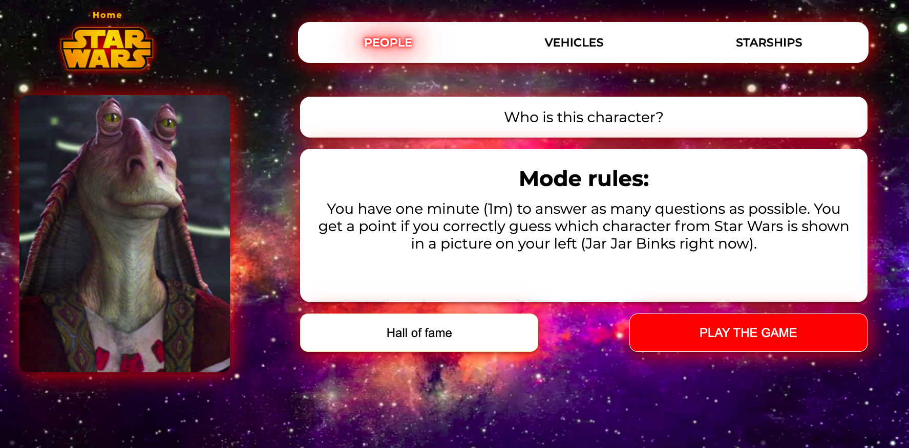
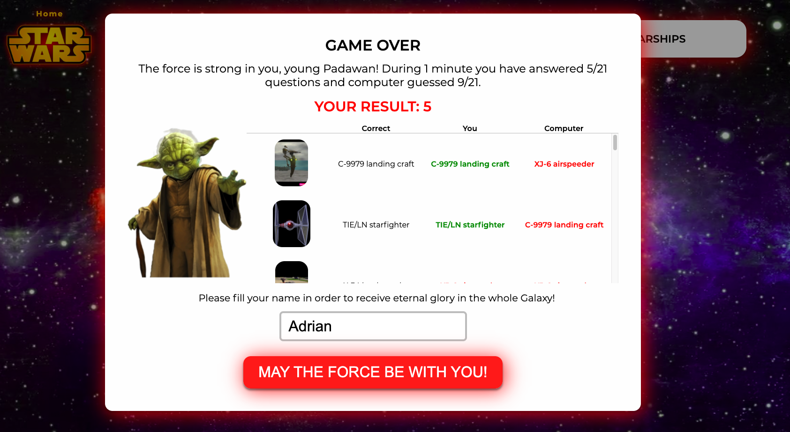
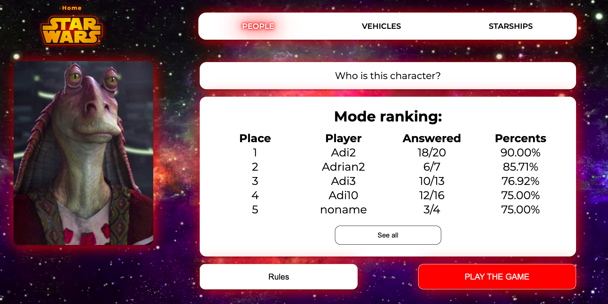
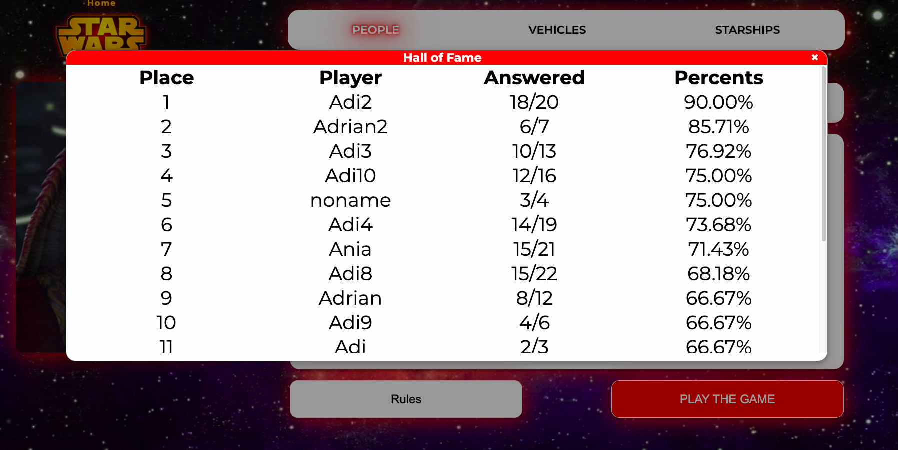

# CodersCamp 2020 - Projekt JavaScript
Wykorzystanie asynchronicznego JavaScript oraz korzystanie z REST API.

W ramach drugiego projektu, zadaniem naszego zespołu było opracowanie quizu z populrnej serii filmów Star Wars. Jest to aplikacja webowa działająca w przeglądarce, bez potrzeby instalacji. Językiem domyślnym aplikacji jest język angielski, sama aplikacja oferuje rozgrywkę w 3 dostępnych kategoriach: 
 - People, 
 - Vehicles, 
 - Spaceships

### Lista funkcjonalności aplikacji

1. Wybór trybu quizu (People, Vehicles, Spaceships) możliwy przed rozpoczciem rozgrywki.
2. Opis zasad dla quizu. Obok zasad pokazuje się losowe zdjęcie z danego trybu (dostosowany opis, jeśli np. imię osoby ze zdjęcia jest w opisie zasad).
3. Po rozpoczęciu gry rozpoczyna się odliczanie czasu (1 minuta).
4. Zadaniem gracza jest odpowiedzieć na jak najwięcej pytań w ciągu ustalonego czasu (dodatkowo gracz konkuruje także z komputerem!). 
5. W trakcie trwania quizu miecz świetlny pokazuje, ile jeszcze czasu zostało. Po wybraniu odpowiedzi zostaje ukazane przez sekundę czy odpowiedź była dobra czy zła. Następnie pytanie zostaje zmienione na kolejne i tak do końca czasu.
5. Pytania są generowane w następujący sposób: 
    - zostaje pobrany losowy zasób z danego trybu (np people o id 5)
    - zostanie pobrane dla wylosowanego zasobu zdjęcie
    - losowane są 3 pozostałe odpowiedzi z zapytania do StarWars API.
6. Po ukończeniu czasu wynik gracza zapisywany jest w rankingu dla danej przeglądarki (LocalStorage) i pokazywany jest ranking 5 najlepszych wyników.

## Wykorzystane technologie:
- JavaScript
- HTML
- CSS
- Star Wars API

## Opis rozgrywki
Zadaniem gracza jest odpowiedzieć na jak najwięcej pytań w określonym czasie (1m). Podczas quizu gracz po zaznaczeniu odpowiedzi dostaje informacje o poprawności swojej odpowiedzi poprzez zmianę koloru przycisku na zielony, w przypadku błędnego wyboru przycisk zmienia się na czerwony, natomiast pokazywana jest również poprawna odpowiedź w kolorze zielonym.

Przykładowa dobra odpowiedź na pytanie:

 
 
Przykładowa zła odpowiedź na pytanie:

 

## Rywalizacja z komputerem

Jednak gracz nie jest pozostawiony sam sobie! Równocześnie z graczem swoją grę rozgrywa komputer, który również zaznacza swoje odpowiedzi kolorem żółtym.

 

Po upływie zadanego czasu, lub wyczerpaniu puli pytań pokazywany jest ekran zakończenia gry, który zawiera podsumowanie gry i liczbę punktów uzyskanych przez gracza oraz komputer. Dostępny jest także pełny spis kolejno udzielanych odpowiedzi przez gracza i komputer wraz ze wskazaniem właściwej odpowiedzi.

 
 
## Ranking rywalizacji

W aplikacji dostępny jest także ranking, pokazujący wyniki 5 najlepszych graczy:

 
 
Istnieje również możliwość przejścia do listy ze wszystkimi uzyskanymi wynikami:

 

#### W projekcie każdy z uczestników zaprezentował praktyczną znajomość poniższych zagadnień związanych z JavaScript:
- zmienne
- operatory porównania
- pętle
- obiekty, atrybuty
- warunki
- funkcje
- operatory logiczne
- tablice
- iteracja i/lub rekurencja
- console
- return
- "===" vs "=="
- integracja z zewnętrznym REST API
- interakcja z domem
- odwoływanie się do elementów DOM z JavaScript
- zmiana stylów z poziomu JSa
- zmiana zawartości HTML z poziomu JSa
- animacje
- async await i/lub Promise
- funkcje callback
- pisanie testów jednostkowych 

Zadaniem projektu była realizacja wymagań klienta, z którym konsultowane były wprowadzane funkcjonalności. Utworzona aplikacja jest responsywna (dostosowana do wyświetlania na Tabletach i Telefonach). Wymogiem klienta było nie tylko działanie aplikacji, ale też napisanie testów, w tym celu aplikacja posiada napisanych kilka testżów jednostkowych sprawdzających poprawność napisanych funkcji.

W celu zaprezentowania działania aplikacja ostateczna wersja została zaprezentowana na Github Pages - link do demo:
 https:...

#### Uruchomienie projektu
Aby uruchomić aplikację na lokalnej maszynie, należy wykonać następujące kroki:
1. Zainstalować zależności za pomocą komendy: `npm install`
2. Wystartować serwer developerski `npm run start:dev`

Aplikacja będzie dostępna pod adresem [localhost:8765/index.html](localhost:8765/index.html)
Kod produkcyjny aplikacji umieszczamy w katalogu `src`.

#### Uruchomienie testów
Aby uruchomić testy aplikacji, należy wykonać następujące kroki:
1. Zainstalować zależności za pomocą komendy: `npm install` (jeśli nie zostsało to zrobione wcześniej).
1. Uruchomić testy, wykonując komendę: `npm run test`. Testy z raportem pokrycia mogą być uruchomione za pomocą: `npm run test:cov`.

Kod testów umieszczony został w katalogu `test`.

##### Dodatkowe zadania (wykraczające poza zakres kursu):
1. Do projektu poza wyświetlaniem 5 najlepszych wyników dodaliśmy także wyświetlanie listy wszystkich wyników uzyskanych przez graczy.

